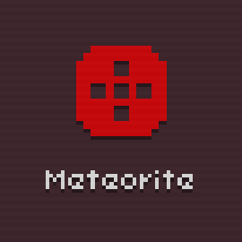
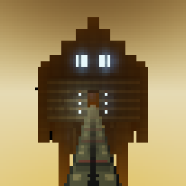
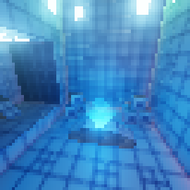
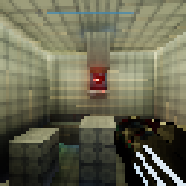
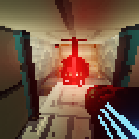
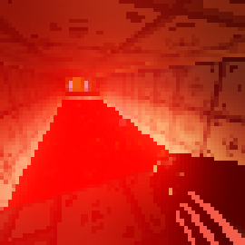
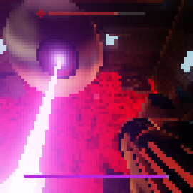

# Meteorite

**Meteorite is a lowres metroidvania FPS, inspired by Metroid Prime, made for LOWREZJAM 2018.** Explore a facility on a far away planet, find gun upgrades, and upgrade your movement capabilities to surpass previously unsurmountable obstacles.

      

Your combative skills and self-defense will be tested by numerous turrets and a giant floating eyeball boss that shoots purple laser beams.

You can download the game here: https://bauxite.itch.io/meteorite

And you can get the soundtrack here: https://kenophos.bandcamp.com/album/meteorite-soundtrack

Also available on the asset store: https://godotengine.org/asset-library/asset/257

[Here's a video of a full playthrough of the game.](https://www.youtube.com/watch?v=wwO46Xt0Sf0)

----

Made in Godot 3.0. 

# Running the game

**Important:** before running the game, you must download a font (since it cannot be freely distributed). If you don't do this the game will not display any text.

1. Download the font [here](http://www.miniml.com/fonts/uni0553/uni0553.zip).
2. Copy the `uni0553-webfont.ttf` file from the zip file to the `fonts/` folder.

That's all.

# Compatibility

The game was developed using Godot 3.0.4. Newer versions of Godot might give trouble (Godot 3.1 alpha is confirmed to be broken)

# License

## Code

The code (everything in the `scripts` and `materials/shaders` folder) is licensed under the MIT license.

## Assets

The assets (everything that is *not* in the `scripts` or `materials/shaders` folder) are licenced under the [CC BY-SA 4.0](https://creativecommons.org/licenses/by-sa/4.0/) license.

## Font

The font used is [Uni 05_53, made by Craig Kroeger](http://www.miniml.com/fonts/uni0553/index.html). The font is not included in the repo.
